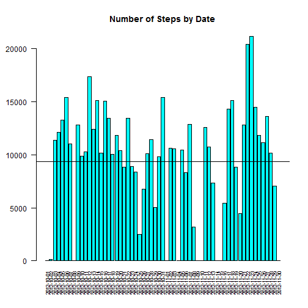
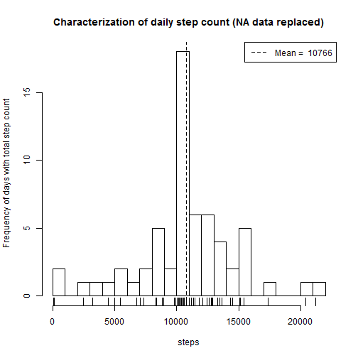

## Objective 1 - Loading and Preprocessing

### 1.1 Loading the dataset

```r
setwd('.')
activity <- read.csv('activity.csv',stringsAsFactors = FALSE)
```

Now we are going to inspect the data, note that there are quite a few NA readings on steps

```r
head(activity)
```

```
##   steps       date interval
## 1    NA 2012-10-01        0
## 2    NA 2012-10-01        5
## 3    NA 2012-10-01       10
## 4    NA 2012-10-01       15
## 5    NA 2012-10-01       20
## 6    NA 2012-10-01       25
```

How many days of data are in the set?

```r
raw_number_of_days <- length(unique(activity$date))
raw_number_of_days
```

```
## [1] 61
```

### 1.2 Processing and transforming the data

Now... we will aggregate the data for each unique date.  Note there are NA preserved

```r
raw_activity_by_date <- aggregate(activity$steps~activity$date,na.action=NULL,FUN=sum)
names(raw_activity_by_date) <- c("date","steps")
head(raw_activity_by_date)
```

```
##         date steps
## 1 2012-10-01    NA
## 2 2012-10-02   126
## 3 2012-10-03 11352
## 4 2012-10-04 12116
## 5 2012-10-05 13294
## 6 2012-10-06 15420
```

Get rid of the NA values (make these zero)

```r
# make NA days turn into 0 step days
raw_activity_by_date$steps[is.na(raw_activity_by_date$steps)] <- 0
```

Check our work: how many days are in **aggr_activity_by_date** data frame? Should be 61.

```r
nrow(raw_activity_by_date)
```

```
## [1] 61
```

## Objective 2 - mean steps taken per day

### What is the mean total number of steps taken per day?

### 2.1 Making a histogram two ways

A Histogram of aggregate (summation) of steps on a particular date

```r
raw_mean <- as.integer(mean(raw_activity_by_date$steps)) # calculate a mean for abline
with(raw_activity_by_date,
      barplot(steps,names=date,las=2,
      col="cyan",
      cex.names=0.7,cex.axis=1.0,mar=c(10,4,4,1),
      main='Number of Steps by Date'))
abline(h=raw_mean) # put in a vertical abline at mean
```

 

Now we can look at it as a histogram of the overall activity pattern

```r
with(raw_activity_by_date, hist(steps,breaks = 20,
                      ylab = "Frequency of days with total step count",
                      main="Characterization of daily step count (histogram)"))
rug(raw_activity_by_date$steps)
abline(v=raw_mean, lty=2)
legend('topright',lty=2,legend=c(paste('Mean = ',raw_mean)))
```

 

### 2.2 Calculate and report the mean and median total number of steps taken per day

####<span style="color:red">NOTE: median and mean were calculated on the RAW data.</span>

Calculate **RAW** mean steps per day.

```r
raw_mean <- mean(raw_activity_by_date$steps,na.rm=T)
raw_mean
```

```
## [1] 9354.23
```

Calculate **RAW** median steps per day.

```r
raw_median <- median(raw_activity_by_date$steps,na.rm=T)
raw_median
```

```
## [1] 10395
```

## Objective 3 What is the average daily activity pattern?

I aggregate steps on all intervals

```r
# aggregate steps (summation) on all intervals
activity_by_interval <- aggregate(activity$steps~activity$interval,FUN=sum)
names(activity_by_interval) <- c("interval","steps")
head(activity_by_interval)
```

```
##   interval steps
## 1        0    91
## 2        5    18
## 3       10     7
## 4       15     8
## 5       20     4
## 6       25   111
```

### 3.1 Time Series Plot of 5 minute interval averaged across all days

Now, lets plot this data with library ggplot2

```r
library(ggplot2)
day_count <- sum(raw_activity_by_date$steps > 0) # day count for days without NA readings
g <- ggplot(activity_by_interval,aes(x=interval,y=steps/day_count)) +
     geom_line() +
     ylab('steps') +
     ggtitle('MEAN steps at various times of the day')
print(g)
```

 

### 3.2 Which 5-minute interval (for all days) has most steps?

08:35 AM is the most active interval of all days averaged

```r
most_active <- subset(activity_by_interval, steps == max(steps))
most_active <- cbind(most_active,mean=most_active$steps/day_count)
most_active
```

```
##     interval steps     mean
## 104      835 10927 206.1698
```


## Objective 4 Inputting missing values

### 4.1 Calculate and report missing values


```r
missing_values <- sum(is.na(activity$steps))
missing_values
```

```
## [1] 2304
```

### 4.2 Strategy for missing values

Strategy: We are going to calculate an aggregation of steps and REMOVE the NA data to reflect ONLY
known values.  This strategy is not the best in that there are a few days where there were lots of ZERO data,
and **we were instructed to replace ONLY NA data.**

Calculate the mean steps per day with ONLY non-NA data

```r
activity_by_date <- aggregate(activity$steps~activity$date,FUN=sum) 
names(activity_by_date) <- c("date","steps") # rename the columns...
known_mean_steps <- as.integer(mean(activity_by_date$steps))
known_mean_steps
```

```
## [1] 10766
```

### 4.3 Building the "Conditioned" dataset

Building this data entails replacing NA day readings with known_mean_steps data which was calculated above.
As per good programming practice in Roger Peng's book, I rebuild the raw_activity_by_date dataset and
then search out the NA entries and replace with the known_mean_steps.


```r
# rebuild raw_activity_by_date to its original form, as per good programming practice
raw_activity_by_date <- aggregate(activity$steps~activity$date,na.action=NULL,FUN=sum)
names(raw_activity_by_date) <- c("date","steps")

# FUNCTION: replace_NA_value(dataset, replacement_value)
replace_NA_value <- function(dataset, replacement_value) {
  # simply replace any steps NA values with the sepcific replacement value
  dataset$steps[is.na(dataset$steps)] <- replacement_value
  dataset
}

fixed_activity_by_date <- replace_NA_value(raw_activity_by_date, known_mean_steps)
head(fixed_activity_by_date)
```

```
##         date steps
## 1 2012-10-01 10766
## 2 2012-10-02   126
## 3 2012-10-03 11352
## 4 2012-10-04 12116
## 5 2012-10-05 13294
## 6 2012-10-06 15420
```

### 4.4 Plot the histogram 2 ways with the "Conditioned" dataset

For the data with NA values replaced, I plot a histogram of aggregate (summation) of steps on a particular date.
This also increases the mean and median converging on the known_mean_steps we calculated above.

```r
fixed_mean <- as.integer(mean(fixed_activity_by_date$steps)) # calculate a mean for abline
with(fixed_activity_by_date,
      barplot(steps,names=date,las=2,
      col="cyan",
      cex.names=0.7,cex.axis=1.0,mar=c(10,4,4,1),
      main='Number of Steps by Date (NA data replaced)'))
abline(h=fixed_mean) # put in a vertical abline at mean
```

 

For the data with NA values replaced, we can look at it as a histogram of the overall activity pattern.

```r
with(fixed_activity_by_date, hist(steps,breaks = 20,
                      ylab = "Frequency of days with total step count",
                      main="Characterization of daily step count (NA data replaced)"))
rug(fixed_activity_by_date$steps)
abline(v=fixed_mean, lty=2)
legend('topright',lty=2,legend=c(paste('Mean = ', fixed_mean)))
```

 

**Replacing the NA data with the mean steps per day impacts mean and median**

It is statistically obvious that central tendency (median and mean) will reflect the mean of the non-NA data.
The median is a perfect reflection of the replacement value because the number of data points is relatively small
and that there were 8 days where NA data was prevalent.

**see below**

Calculate **FIXED dataset mean steps per day**

```r
mean_steps_per_day <- mean(fixed_activity_by_date$steps, na.rm=T)
mean_steps_per_day
```

```
## [1] 10766.16
```

Calculate **FIXED dataset median_steps_per_day**

```r
median_steps_per_day <- median(fixed_activity_by_date$steps, na.rm=T)
median_steps_per_day
```

```
## [1] 10766
```

## Objective 5 Differences in activity patterns between weekdays and weekends

For this part the weekdays() function may be of some help here. Use the dataset with the filled-in missing values for this part.

### 5.1 Creating a factor variable and other homework to compare weekend/weekday

This is a little tricky to do, I am sure there have to be better methods but I know how to do it this way.

1. Subset the activity for weekends (Saturday and Sunday)

2. create a factor variable (column) called day_type

3. create a MEAN (column) this has to be done separately, because the basis of days varies between weekend and weekday

4. repeat steps 1-3 for weekdays.

5. merge together in **all_activity_by_interval**


```r
library(chron)
```

```
## Warning: package 'chron' was built under R version 3.2.3
```

```r
# create a weekend dataframe
weekend_activity <- subset(activity, is.weekend(date))
weekend_activity_by_interval <- aggregate(weekend_activity$steps~weekend_activity$interval,FUN=sum)
names(weekend_activity_by_interval) <- c("interval","steps")
weekend_days <- length(unique(weekend_activity$date))
weekend_activity_by_interval <- cbind(weekend_activity_by_interval, day_type='Weekend')
weekend_activity_by_interval <- cbind(weekend_activity_by_interval,
                                      mean=weekend_activity_by_interval$steps/weekend_days)

# create a weekday dataframe
weekday_activity <- subset(activity, !is.weekend(date))
weekday_activity_by_interval <- aggregate(weekday_activity$steps~weekday_activity$interval,FUN=sum)
weekday_days <- length(unique(weekday_activity$date))
names(weekday_activity_by_interval) <- c("interval","steps")
weekday_activity_by_interval <- cbind(weekday_activity_by_interval, day_type='Weekday')
weekday_activity_by_interval <- cbind(weekday_activity_by_interval,
                                      mean=weekday_activity_by_interval$steps/weekday_days)

# merge as ALL activity
all_activity_by_interval <- rbind(weekend_activity_by_interval,weekday_activity_by_interval)
```

### 5.2 A facet plot of weekend vs weekday activity

Finally, lets graph all activity with Weekend and Weekday facets

```r
g <- ggplot(all_activity_by_interval,aes(x=interval,y=mean)) +
     geom_line() +
     facet_grid(day_type ~ .) +
     ylab('mean steps') +
     ggtitle('MEAN steps activity on Weekend vs Weekdays')
print(g)
```

 
